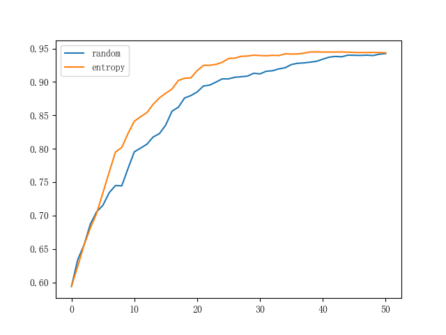
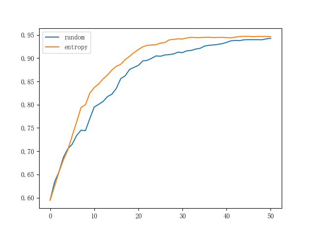
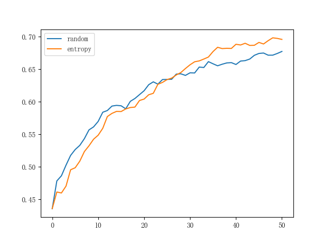
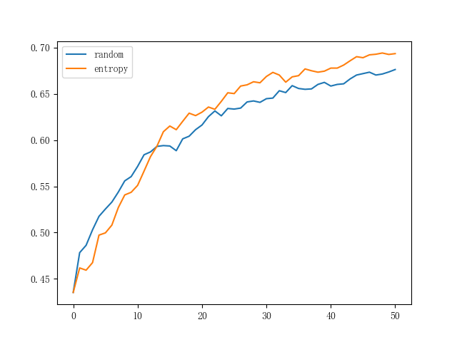

# ActiveLearningDemo

## How to run 

1. step one 

put the dataset folder and use command below to split the dataset to the required structure

```bash
run utils.py 
```

For each dataset, six .mat documents should be included: TrainingMatrix.mat, TrainingLabels.mat, TestingMatrix.mat, TestingLabels.mat, UnlabeledMatrix.mat and UnlabeledLabels.mat.

2. step two

Train the model. You can set arguments:

```bash
Active learning

optional arguments:
  -h, --help            show this help message and exit
  --src SRC             dataset path
  --dst DST             destination path
  --type TYPE           sample strategy:random, entropy, combine
  --solver SOLVER       model solver
  --max_iter MAX_ITER   max iteration of each training
  --k K                 samele added for each iteration
  --n N                 number of iterations
  --plot_type PLOT_TYPE
                        plot single for one case(single) or plot average for
                        entire database(average) 
```

You can utilize both one dataset with multiple subsets inside and one case of a dataset with only six .mat documents. By default, I used "newton-cg" solver and "combine" type which can train model with both strategies at once. To get results on different datasets directly, you can use:

```bash
python main.py --src your dataset path(./datasets/MMI) --dst output path(./img)
```

##  Result

1. MMI dataset

use "lbfgs" solver:



use "newton-cg" solver:



2. MindReading dataset

use "lbfgs" solver:



use "newton-cg" solver:

 


